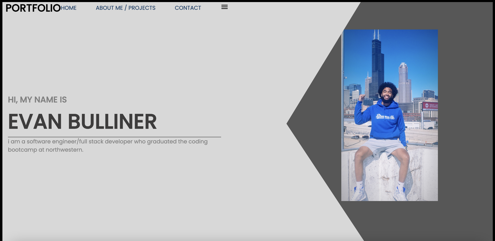
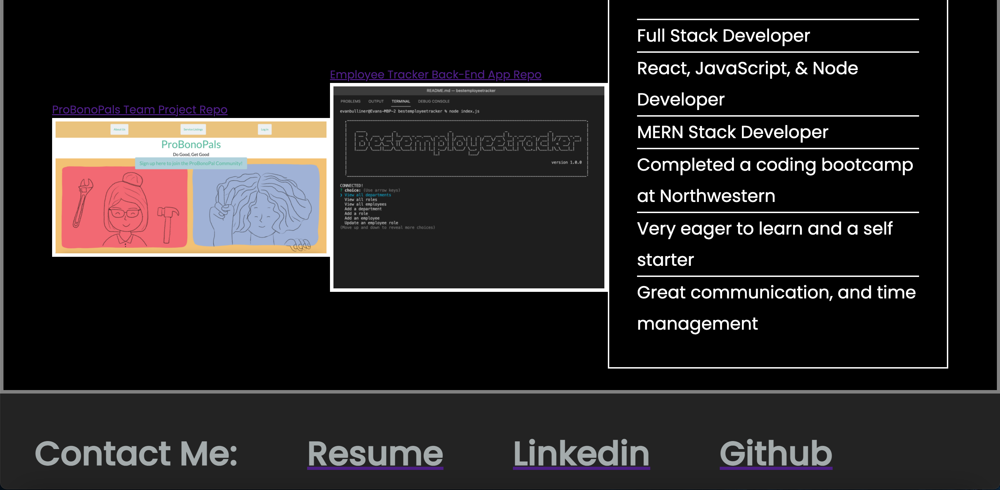

# React Portfolio 
[]

  This is my portfolio that I made using React!

  # Table of Contents:
  * [Installation](#installation)
  * [Usage](#usage)
  * [Contributing](#contributing)
  * [Tests](#tests)
  * [Questions](#questions)
  * [License](#license)
---
  ## Installation:
  There is no installation needed. All you have to do is follow the link to my site!

  Link to website: https://wonderful-shockley-497611.netlify.app/

  ## Usage:
  To show off my skills and show that I'm employer ready!

  ## Contributing:
  Used a template from a youtube video that I  got some help from. It explained a lot and answered a lot of questions that I had when it came to making this portfolio. Her name was elnfar and her github is https://github.com/elnfar 
  ## Tests:
  N/A
  ## Questions:
  For any further assistance, you may contact me at:
  * Github: [ebulliner](<https://github.com/ebulliner>)
  OR
  * Email: evan_bulliner@yahoo.com
  ---
  ___
# License
  ## MIT
  This project is licensed under the [MIT License](https://opensource.org/licenses/MIT).